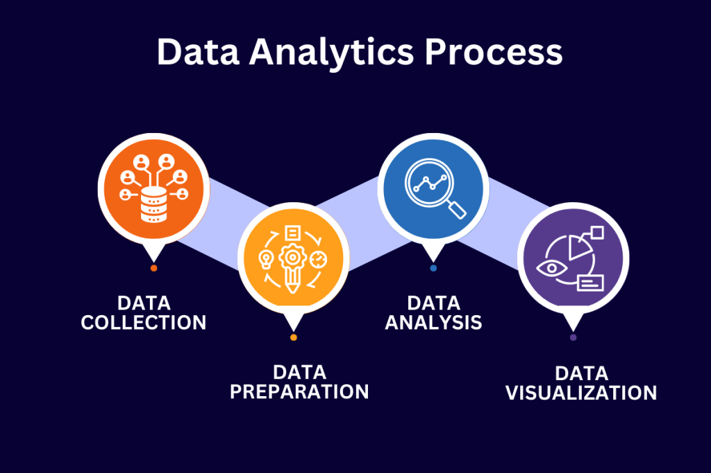
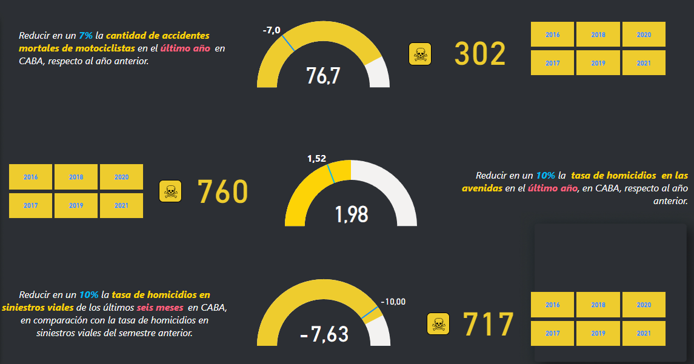

<h1 align="center"> Proyecto Data Analytics  🚀</h1>

## Contenido

- [Descripción del Proyecto](#descripción-del-proyecto)
- [Objetivo](#objetivo)
- [Esquema de Proyecto](#esquema-del-proyecto)
- [Analítica de Información de Proyecto](#analítica-de-información-de-proyecto)
- [Problemática del Proyecto](#problemática-del-proyecto)
- [Desarrollo de Proyecto](#desarrollo-del-proyecto)
- [Análisis de los datos](#análisis-de-los-datos)
- [KPIs](#kpis)
- [Conclusiones](#conclusiones)
- [Herramientas del proyecto](#herramientas-del-proyecto)

## Descripción del Proyecto

En este proyecto, se simula el papel de un Analista de Datos que integra el equipo de una empresa consultora. Este equipo ha sido contratado por el Observatorio de Movilidad y Seguridad Vial (OMSV), un centro de estudios bajo la jurisdicción de la Secretaría de Transporte del Gobierno de la Ciudad Autónoma de Buenos Aires (CABA), para llevar a cabo un análisis de datos detallado.

## Objetivo

Proporcionar insights significativos y recomendaciones basadas en datos para mejorar la comprensión de la movilidad y la seguridad vial en la ciudad. A través de la recopilación, procesamiento y análisis de datos relevantes, nuestro equipo buscará identificar patrones, tendencias y áreas de mejora en el contexto del tráfico y la seguridad vial.

## Esquema del Proyecto

## Analítica de Información de Proyecto

En esta ocasión, se dispone de Datasets importantes para nuestro proyecto. Hemos empleado un conjunto de datos que detalla información sobre víctimas fatales y lesionados por parte del Observatorio de Movilidad y Seguridad Vial (OMSV) de la Ciudad Autónoma de Buenos Aires (CABA). Los dos conjuntos de datos asociados se encuentran almacenados en la carpeta Dataset, la cual se presenta a continuación:

- `homicidios.xlsx`: Alberga información detallada sobre los accidentes fatales ocurridas en la Ciudad Autónoma de Buenos Aires . La información incluye aspectos clave como la dirección, fecha, víctima, roles, vehículos, gravedad, etc.

## Problemática del Proyecto

Los siniestros viales, también conocidos como accidentes de tráfico, son eventos que ocurren en la vía pública y pueden involucrar uno o varios vehículos, resultando en daños materiales y, en casos más graves, heridos o pérdidas humanas.

 El uso correcto de medidas preventivas, como el ajuste del cinturón de seguridad o el uso de casco en motocicletas o bicicletas, puede ser crucial para reducir la gravedad de las consecuencias.

Las causas de los accidentes de tránsito suelen ser variadas, pero se destacan principalmente por factores humanos, como conducir bajo la influencia del alcohol o realizar maniobras imprudentes. El factor mecánico también desempeña un papel cuando los vehículos no reciben el mantenimiento adecuado.

Enfocándonos en nuestro proyecto, que se centra en la capital de Argentina, una ciudad densamente poblada, es esencial abordar estas problemáticas específicas. Se debe prestar especial atención a las condiciones climáticas, el mantenimiento de las vías y la educación vial para reducir la incidencia de siniestros viales y garantizar la seguridad de los residentes.

## Desarrollo del Proyecto

Se realizó un proceso de extracción, transformación y carga de los datos (ETL), tanto de "HECHOS" como "VÍCTIMAS", donde se estandarizaron nombres de las variables, se analizaron nulos y duplicados de los registros, se eliminaron columnas redundantes o con muchos valores faltantes, entre otras tareas. Una vez finalizado este proceso para los dos conjuntos de datos de "Homicidios" se procedió a unir los dos conjuntos en uno solo denominado `homicidios`.

Se realizó un análisis exploratorio (EDA), con la finalidad de encontrar patrones que permitan generar información que le permita a las autoridades locales tomar medidas para disminuir la cantidad de víctimas fatales de los siniestros viales. Todos los detalles de este análisis se encuentran [aquí](https://github.com/Ivan2125/Data-Analytics-Siniestros-Viales/blob/main/01-eda.ipynb) .

## Análisis de los datos

Lo primero que se analizó fue variable temporal, para entender la distribución de los homicidios en distintas escalas temporales. La distribución anual de la cantidad de víctimas fatales es de alrededor del 60% para los primeros 3 años del conjunto de datos, con una disminución marcada para el 2020 como consecuencia de la cuarentena por COVID 19. El comportamiento a lo largo del año, es decir, la variación mensual, si bien para todo el conjunto de datos es marcada, con un pico de víctimas en Diciembre.

Se observa que el 70% de las victimas perdieron la vida en entre lunes y viernes, lo que haría pensar que se debe al traslado diario al trabajo, pero en la distribución semanal no se observan diferencias significativas entre los distintos días. Es decir, la cantidad de víctimas un sábado o un domingo, para todo el conjunto de datos, es aproximadamente el mismo.

Si se analizan las franjas horarias, las mayores víctimas, que representa el 12% de las víctimas, se presentaron en el horario entre las 6 a 8 de la mañana, lo que también hace pensar en el horario de ingreso a los trabajos. Pero si se analiza esta franja en particular, se observa que el 55% de estas víctimas resultaron de hechos ocurridos durante el fin de semana.

En primer lugar, el 77% de las víctimas son masculinas. Casi el 50% de las víctimas se encuentran en un rango etario entre los 25 a 25 años de edad, de los cuales entre el 84% de ellos son masculinos.

Si se observa que rol de la víctima, es decir la posición relativa que ocupaba al momento del hecho, el 48% era conductor. En particular, este 48% se distribuye en un 77% de víctimas que se movilizaban en moto y 19% en auto. En relación a la cantidad de víctimas según el medio de transporte al momento del hecho, el 42% de las víctimas son conductores de moto.

Asimismo, si se analiza la responsabilidad en el hecho, es decir, el vehículo que ocupaba quien resultó acusado, en el 29% de los casos fue el auto, pero en el 75% son responsabilidad de vehículos como auto, colectivos y camiones.

Por último, se buscaron patrones en la distribución espacial de los hechos. Lo que se destaca de este análisis, es que en todas las comunas de CABA se presenta como factor común los accidentes en las avenidas, que son vías arteriales de calzada ancha, de por lo menos 13 metros. El 62% de las víctimas perdió la vida en avenidas. En cuanto al rol de la víctima al momento del hecho, en las distintas comunas varía entre moto y peatón.

## KPIs

En el marco del análisis de los siniestros viales y con el objetivo de reducir la cantidad de víctimas fatales, se han definido dos Indicadores Clave de Rendimiento (KPI) que abordan aspectos específicos de la seguridad vial en CABA. Para poder realizar el analisis de los indicadores se crearon Tablas para facilitar dicho proceso

KPI 1 - Métrica de Seguridad en Accidentes Viales:

La métrica de seguridad en accidentes viales se configura como un indicador esencial, evaluando el número de víctimas fatales en incidentes de tráfico por cada 100,000 habitantes durante un semestre. La meta consiste en reducir esta métrica en un 10% en el segundo semestre de 2021 en comparación con el primer semestre. El análisis demuestra que al alcanzar una métrica de 1.35, se superó con éxito el objetivo de disminuir en un 10% la tasa de fatalidades, ya que la métrica previa era de 1.73, logrando así una reducción del 22.22%.

KPI 2 - Incidentes Mortales Involucrando Motociclistas:

El segundo KPI se enfoca en supervisar la cantidad de incidentes mortales relacionados con motociclistas. El propósito es reducir en un 7% la cantidad de accidentes mortales de motociclistas durante el último año. No obstante, los resultados indican un aumento del 79.21% en la cifra de fallecimientos de motociclistas en 2021, señalando la necesidad de estrategias adicionales. Es importante tener en cuenta que el año 2020 estuvo marcado por una pandemia y restricciones de movimiento, lo cual impactó la circulación en las calles.

En resumen, la implementación de estrategias para mejorar la seguridad vial en CABA ha tenido éxito en ciertos aspectos, como la disminución de la tasa de fatalidades en accidentes viales. Sin embargo, se requieren acciones más efectivas para abordar el incremento de incidentes mortales con motociclistas. Se hace imperativo ajustar las estrategias existentes y desarrollar nuevas iniciativas para hacer frente a los desafíos identificados por los KPI.

KPI 3 Reducir tasa de homicidios en las avenidas en el último año:

Como se vio en el análisis exploratorio, la mayoría de las víctimas mortales transitaban por avenidas al momento del hecho. Se define a la Tasa de homicidios en las avenidas al número de víctimas fatales en accidentes de tránsito en avenidas por cada 100,000 habitantes en un área geográfica durante un período de tiempo específico, en este caso anual.
    

## Conclusiones

Entre los años 2016 a 2021 se registraron 716 víctimas fatales en accidentes de tránsito. El 71% de las víctimas se registraron durante la semana. En cuanto a la franja horaria, el 12% de los hechos ocurre entre las 6 y las 8 de la mañana, pero durante los fines de semana. Diciembre es el mes que resulta con el máximo de fallecimientos en el período analizado.

El 77% de las víctimas fatales fueron de sexo masculino, de los cuales casi el 50% tenía entre 25 y 44 años de edad. En relación al tipo de usuario, el 42% fueron motociclistas. El 62% de los homicidios ocurrió en algún punto de las avenidas de CABA, siendo el 82% de ellos en un cruce de la autopista con alguna otra calle. En ese sentido, el 75% de los hechos ocurrieron en cruces de calles.

Finalmente, para el segundo semestre del año 2021, se cumplió con el objetivo de bajar la tasa de homicidios en siniestros viales, pero no se cumplieron los objetivos de reducir la cantidad de accidentes mortales en motociclistas ni en avenidas para el año 2021 respecto del año 2020.

## Herramientas del proyecto

